# You Only Cache Once (YOCO): A Breakthrough in Efficient Language Modeling

#### Team Members:
- Tanhiat Fatema Afnan (1905014)
- Nahida Marzan (1905075)
- Mehreen Tabassum Maliha (1905078)

#### Blog Details
- **Written By**: Nahida Marzan, a Computer Science and Engineering undergraduate from BUET
- **Date**: January 7, 2025

---
### Authors
Yutao Sun, Li Dong, Yi Zhu, Shaohan Huang, Wenhui Wang, Shuming Ma, Quanlu Zhang, Jianyong Wang, Furu Wei

### Paper
[You Only Cache Once: Decoder-Decoder Architectures for Language Models](https://arxiv.org/abs/2405.05254)

### Code Repository
[YOCO GitHub Repository](https://github.com/microsoft/unilm/tree/master/YOCO)

---

## Introduction: A New Era for Language Models

As the field of large language models (LLMs) continues to evolve, the race to make them faster, more efficient, and less resource-intensive has never been more critical. From creating custom hardware like Groq’s Language Processing Units to optimizing libraries like Apple’s MLX and NVIDIA’s CUDA, efforts abound to enhance LLMs' performance. Yet, these efforts often neglect a crucial bottleneck: memory and computation inefficiencies in existing transformer architectures.

Enter **YOCO** (You Only Cache Once) — a revolutionary decoder-decoder architecture that promises to redefine how we think about memory and computation in LLMs. Designed for efficiency and scalability, YOCO addresses key challenges in KV caching and inference latency, paving the way for smarter, leaner LLMs.

Let’s dive in!

---

## Key-Value (KV) Cache: The Bottleneck of Large Language Models

Transformers rely on **Key-Value (KV) caching** to store KV pairs for each token, avoiding redundant computations during inference. While this approach improves speed, it creates a significant **memory bottleneck** as sequence length grows.

- **The Problem:**

  1. KV cache memory usage grows linearly with sequence length.
  2. Large models like a **65B parameter Transformer** require **86GB of GPU memory** to process a 512K sequence length.
  3. Such memory demands exceed the capacity of cutting-edge hardware like NVIDIA’s **H100 GPUs**.

- **The Solution:**

  - YOCO introduces a **decoder-decoder architecture** that caches KV pairs only once and reuses them across layers.
  - By doing this, it **drastically reduces memory consumption** while maintaining fast and accurate inference.

- **Key Benefits of YOCO:**

  1. **Reduced GPU Memory Requirements:** Eliminates the need for redundant KV caches, enabling efficient handling of long sequences.
  2. **Enhanced Scalability:** Supports ultra-long contexts without overwhelming hardware resources.
  3. **Improved Cost-Effectiveness:** Lowers memory overhead, making LLM deployment accessible on a wider range of hardware.

By addressing the memory bottlenecks inherent in traditional transformer architectures, YOCO enables smarter and leaner LLMs. Its innovative approach represents a significant leap forward in making large-scale language models more practical and efficient for real-world applications.

## YOCO Architecture Design

### Two-Part Design

The YOCO architecture consists of two main components: the **self-decoder** and the **cross-decoder**. These are stacked into **L blocks**, where:
- The first **L/2 layers** form the **self-decoder**.
- The remaining **L/2 layers** form the **cross-decoder**.

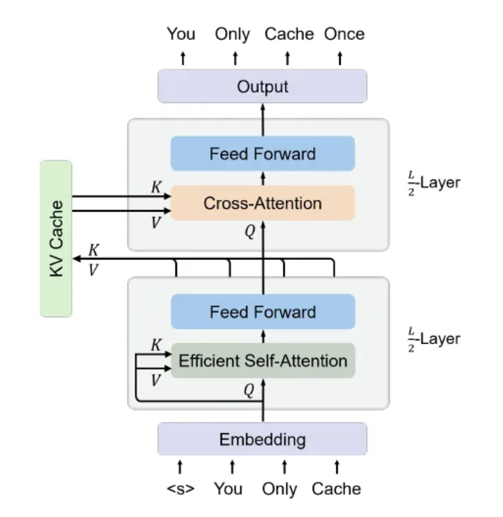

### Key Similarities
Both the self-decoder and cross-decoder:
- Use a block layout similar to Transformers.
- Interleave **attention mechanisms** with **feed-forward networks**.

### Key Differences
- **Self-Decoder**: Employs **efficient self-attention (ESA)**, such as sliding-window attention.
- **Cross-Decoder**: Uses **global cross-attention**, attending to shared **KV caches** generated by the self-decoder.

---

## Components of YOCO

### i) Self-Decoder

#### Role:
**The self-decoder:**
- Takes the token embeddings (**X₀**) as input.
- Computes intermediate representations (**M = Xᴸ/²**).

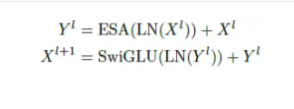

where ESA(·) represents efficient self-attention

#### Features:
- Utilizes **efficient self-attention (ESA)** for memory-efficient processing.
- Applies **causal masking** to ensure autoregressive generation.
- Guarantees **O(1) inference memory** with a constant number of KV caches.

---

### ii) Cross-Decoder

#### Role:
**The cross-decoder:**
- The output of the self-decoder (**Xᴸ/²**) generates global KV caches (**ˆK**, **ˆV**) for the cross-decoder:

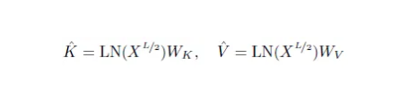

Where **Wₖ**, **Wᵥ** ∈ ℝd×d are learnable weights.

#### Process:
- **Layer Stacking**: Cross-decoder layers are stacked after the self-decoder to obtain the final output vectors (**Xᴸ**).
- **KV Cache Reuse**: The KV caches (**ˆK**, **ˆV**) are reused by all the **L/2 cross-decoder modules**:

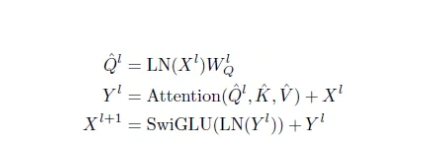

where  **Attention(·)** is standard multi-head attention, and **Wˡᵩ** ∈ ℝd×d is a learnable matrix.

- **Causal Masking**: Used for cross-attention to ensure autoregressive generation.
- **Group Query Attention**: Compatible with group query attention, which further reduces the memory consumption of KV caches.

#### Output:
- After obtaining **Xᴸ**, a **softmax classifier** performs next-token prediction.

---

## Inference Advantages of YOCO

### 1. Efficient Memory Usage: Saving GPU Resources and Supporting More Tokens

YOCO introduces significant memory savings by:
- Reusing global KV caches.
- Employing **efficient self-attention**.

#### Memory Complexity Comparison:
- **YOCO**: **O(N + CL)**, where:
  - **N** = input length.
  - **C** = sliding window size (constant).
  - **L** = number of layers.
- **Transformers**: **O(N × L)**, requiring KV caches for every layer.

#### Impact:
- For long sequences, YOCO requires approximately **O(N)** caches.
- Achieves an **L-times memory reduction** compared to traditional Transformers.

---

### 2. Accelerated Inference: Faster Prefilling and Higher Throughput

YOCO accelerates the prefill stage by enabling **early exits** in the cross-decoder without altering the final output.

Figure below shows YOCO Inference. Prefill: encode input tokens in parallel. Generation: decode output tokens one by one.

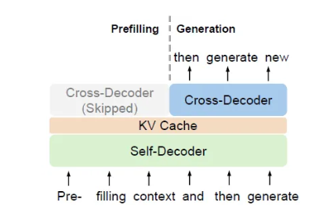

#### Impact on Performance:
- **Significant speedup** during prefill.
- Improved **throughput** during generation.
- Ideal for **real-time applications**.

---

## Advanced Design Choices of the Self-Decoder

### i) Gated Retention

#### What It Is:
**Gated retention (gRet)** integrates a data-dependent gating mechanism with retention modules, achieving:
- **Parallel training**.
- **Low inference cost**.
- **Strong performance**.

#### Representation Types:
1. **Parallel Representation**:
   - Leverages trainable weights (**Wᵩ, Wₖ, Wᵥ**) and a temperature term (**τ**) for better memorization.

2. **Recurrent Representation**:
   - Allows sequential computation for each timestep.

3. **Chunkwise Recurrent Representation**:
   - Divides computation into inner-chunk and cross-chunk parts for efficiency.

4. **Multi-Head Gated Retention**:
   - Extends gated retention to multi-head setups.
   - Improves non-linearity with **GroupNorm** and **swish gates**.

---

### ii) Sliding-Window Attention

#### What It Is:
**Sliding-window attention** restricts attention to a fixed window size (**C**) rather than attending to all previous tokens.

#### Features:
- Reduces KV cache memory complexity from **O(N)** to **O(C)**.
- Applies window causal masks to ensure queries attend only to nearby tokens.
- Retains **parallel computation** for scalability.

Similar to **multi-head self-attention**, the output of sliding-window attention is computed as:

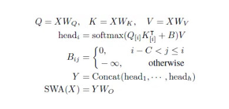

where WQ,WK,WV ,WO ∈ Rd×d are learnable matrices,
- The **window causal mask (B)** ensures that each query only attends to the previous keys whose distances are less than **C**.

#### Impact:
- Makes memory usage **constant**, independent of sequence length.
- Enables YOCO to process **long sequences efficiently**.

# Experiments

## 1. Language Modeling Evaluation

- **Model and Comparison:**  
  - A 3B-size YOCO language model was trained by scaling up the number of training tokens to maximize its potential.
  - YOCO checkpoints were rigorously compared against prominent Transformer-based language models, including OpenLLaMA-v2–3B, StableLMbase-alpha-3B-v2, and StableLM-3B-4E1T.

- **Training Recipe:**  
  - The authors adopted a training recipe inspired by StableLM-3B-4E1T, ensuring a robust and proven methodology.

- **Evaluation Method:**  
  - The LM Eval Harness [3] framework was utilized to evaluate the model's zero-shot performance across a variety of downstream tasks.

- **Results:**  
  - YOCO demonstrated results on par with other highly optimized Transformer-based models, proving its competence.
  - The model also showcased excellent scalability when increasing the number of training tokens, indicating its adaptability for larger datasets.

---

## 2. Scalability Compared with Transformers

- **Scaling Curves Analysis:**  
  - A comprehensive comparison was performed between:
    - The Llama Transformer architecture.
    - YOCO with gated retention (YOCOgRet).
    - YOCO with sliding-window attention (YOCOSWA).
  - Models of varying sizes (160M, 400M, 830M, 1.4B, 2.7B, 6.8B, and 13B) were trained using consistent data and settings for fair benchmarking.

 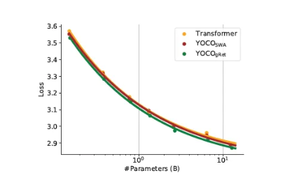

- **Architecture Enhancements:**  
  - Transformer architectures were further refined with Llama-specific improvements, such as RMSNorm, SwiGLU activation, and the removal of bias, boosting overall performance.

- **Findings:**  
  - YOCO proved to be highly competitive, achieving similar results across all parameter sizes (160M to 13B) compared to Llama-optimized Transformer architectures.
  - Among the tested variants, YOCOgRet stood out, outperforming both Transformers and YOCOSWA. This was attributed to its innovative hybrid design combining attention and retention mechanisms, which leverage complementary inductive biases.

---

## 3. Long-Context Evaluation

- **Extended Context Length:**  
  - YOCO-3B was extended to handle a context length of 1M tokens, pushing the boundaries of long-context capabilities.
  - Evaluations focused on needle retrieval and language modeling tasks, which are critical benchmarks for long-context models.

### a) Needle In A Haystack
- **Task and Performance:**  
  - YOCO-3B-1M excelled in the Needle-In-A-Haystack test, achieving near-perfect accuracy.
  
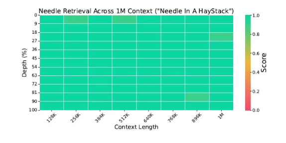

  - This result underscores YOCO's ability to effectively handle long-context modeling, a key challenge for many models.

### b) Multi-Needle Retrieval
- **Evaluation Method:**  
  - Accuracy was assessed with multiple needles (N):
    - N = 1 indicates single-needle retrieval, serving as a reference baseline.
    - N > 1 represents multi-needle tests to evaluate the model's capacity for complex retrieval tasks.
  - Evaluations were conducted at a 128K length, aligning with the tuning parameters of previous long-context models.

  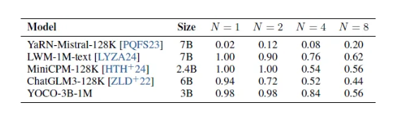

- **Results:**  
  - YOCO-3B-1M delivered comparable performance to LWM-1M-text (a continuation of Llama-2–7B) while using only half the model size, demonstrating exceptional efficiency.
  - Moreover, it surpassed other state-of-the-art models like MiniCPM-128K and ChatGLM3–128K, establishing itself as a superior option for multi-needle retrieval tasks.

### c) Perplexity over Long Sequences
- **Analysis:**  
  - The cumulative average negative log-likelihood (NLL) was measured as a function of context length, providing insight into the model's ability to process longer sequences.
   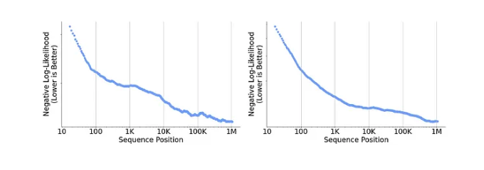

- **Findings:**  
  - NLL consistently decreased as sequence length increased, affirming YOCO's ability to leverage long-distance dependencies effectively.
  - This result highlights YOCO's potential for handling complex, long-context language modeling scenarios with impressive precision.

## 4. Inference Advantages

### a) GPU Memory

- **Memory Composition:**  
  - Inference memory consumption consists of three components:  
    1. Model weights.  
    2. Intermediate activation.  
    3. KV cache.  
  - The breakdown of memory profiling results is presented in the figure below.

  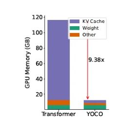

- **Findings:**  
  - As context length increases, KV caches dominate memory consumption, while model weights remain constant.
  - YOCOgRet excels by drastically reducing the activation cost and KV cache memory footprint, offering a scalable solution for memory-intensive tasks.
  - The figure below shows:
    - Inference memory usage of Transformers and YOCO across various lengths, highlighting the reduced memory cost of YOCO.

    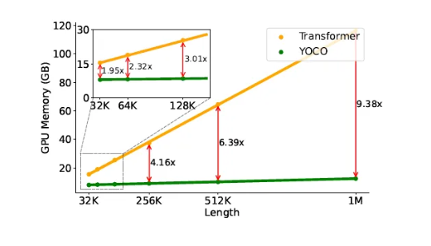

    - GPU memory consumption of KV cache per token for different model sizes.

    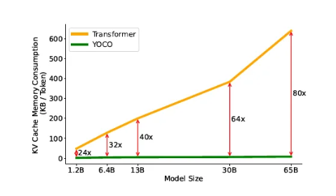
  - **Efficiency:**  
    - By caching only one layer of global key-value pairs, YOCO reduces memory requirements by approximately **L times** compared to Transformers, making it highly efficient for long-context tasks.

---

### b) Prefilling Latency

- **Definition:**  
  - During the prefill stage, the model processes input tokens in parallel to encode them.
  - Prefilling latency measures the time taken to encode the input prompt before generating the first token.

- **Findings:**  
  - The figure below shows the prefilling latency for different input lengths.

  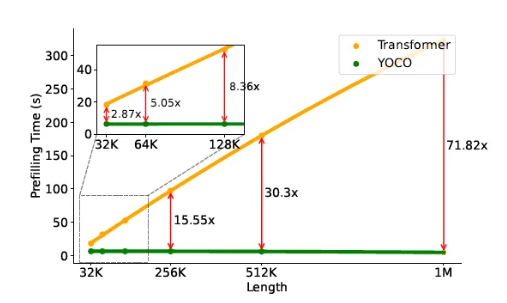

  - **Performance Comparison:**  
    - While Transformers suffer from quadratically increasing latency with input length, YOCO's latency scales linearly, demonstrating superior efficiency.
    - Even for relatively short input lengths, such as 32K, YOCO achieves a remarkable **2.87× speedup** compared to Transformers, underscoring its practical advantage in latency-critical scenarios.

---

### c) Throughput

- **Definition:**  
  - Throughput refers to the number of tokens the model can process per second, encompassing both the pre-filling and generation stages.

- **Findings:**  
  - The figure below shows the inference throughput of Transformers and YOCO across varying context lengths.

  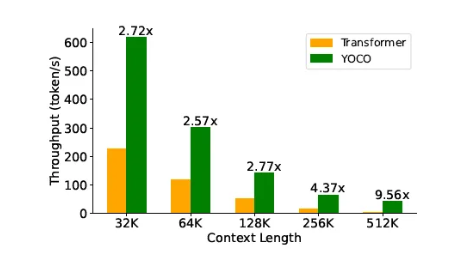

  - YOCO achieves **significantly higher throughput** than Transformers across all tested context lengths, showcasing its ability to handle large-scale token processing with ease and efficiency.

---
## **Interpretation & Insights**

**1. A Single Cache, Multiple Benefits**  
By storing only one global KV cache, YOCO breaks away from the layer-by-layer storage model—slashing memory usage without sacrificing performance. This design choice aligns with broader industry efforts to make large language models more computationally efficient.

**2. Balanced Complexity vs. Gains**  
Though YOCO introduces an extra architectural split (self-decoder vs. cross-decoder), the paper’s results confirm that any additional complexity is well-justified by substantial memory savings at inference time.

**3. Boosting Efficiency with Other Methods**  
YOCO’s memory-friendly approach leaves room to integrate further optimizations:

- **Sparse Attention / Mixture of Experts** for less computational overhead.  
- **Quantization & Pruning** to shrink model footprints.  
- **Specialized Hardware** designed for sparse ops, amplifying YOCO’s speedups.

**4. Practical Scope & Future Promise**  
YOCO’s 1M-token context capability enables real-world tasks like multi-document summarization, extended conversational agents, large-scale code completions, or on-the-fly analytics—all at a fraction of the memory cost. Its single-cache approach also hints at potential for on-device LLMs, fueling edge deployments with minimal latency.

**5. Open Questions**  
- **Fine-Tuning**: More research is needed on how YOCO adapts to new tasks or domains.  
- **Scaling Past 1M Tokens**: Can it stretch even further? Are there limits to single-cache approaches at extreme contexts?  
- **Multimodality**: Extending YOCO’s design to handle text+image or other input types remains an exciting challenge.

---

## **Applications & Future Directions**

- **Technical & Code Docs**: Process entire repositories or large documentation sets with efficient memory usage.  
- **Search & Indexing**: Excel in long-range retrieval tasks, scanning massive corpora in a single pass.  
- **Legal & Financial Analysis**: Tackle documents with tens of thousands—or even millions—of tokens.  
- **Interactive Agents**: Maintain extensive chat histories and deeper reasoning without ballooning GPU overhead.  
- **On-the-Fly Summaries**: Handle real-time data feeds and generate summaries without breaking memory budgets.

---

## **Conclusion**
By redesigning KV caching into a one-cache-fits-all paradigm, **YOCO** sets a new bar for memory efficiency and scalability in large language models. Its architecture gracefully balances added design elements with the significant benefits of reduced GPU usage, faster inference, and the ability to process lengthy sequences—all of which point to a promising future of accessible, high-performing LLMs.

